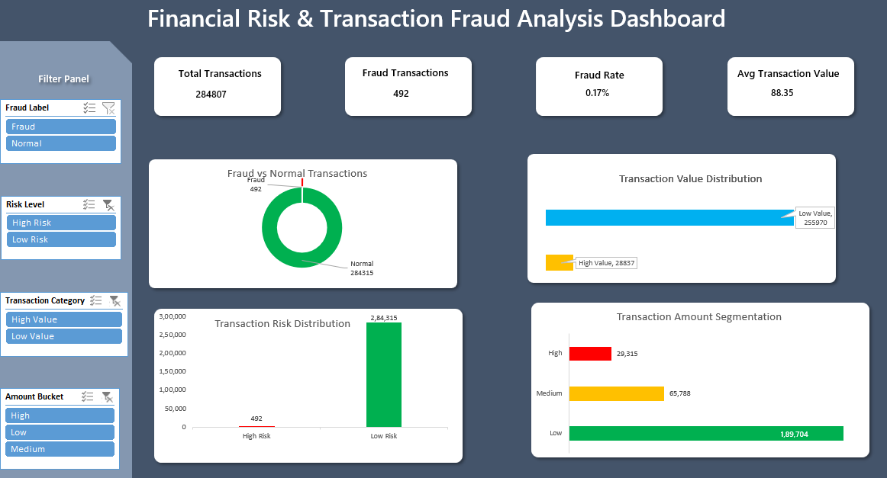

# 📊 Financial Risk & Transaction Fraud Analysis Dashboard (Excel)

## 📌 Project Overview

This project explores financial transaction data to identify potential fraud, understand risk levels, and uncover patterns in how transactions occur.

The dashboard presents these insights in a clear and interactive way, making it easier to spot unusual activity and support better decision-making.

---

## 🎯 Business Problem

Financial institutions face challenges in detecting fraudulent transactions due to the highly imbalanced nature of transaction data.

This project aims to:

* Identify fraudulent transactions
* Analyze transaction risk levels
* Understand spending patterns
* Provide insights for fraud prevention strategies

---

## 🛠️ Tools & Technologies

* **Microsoft Excel**
* Pivot Tables & Pivot Charts
* Slicers (Interactive Filters)
* Data Cleaning & Transformation

---

## 📊 Dataset

The dataset used in this project is the **Credit Card Fraud Detection dataset**, which contains real-world anonymized transaction data.

👉 Download Dataset:
https://storage.googleapis.com/download.tensorflow.org/data/creditcard.csv

---

## 📊 Dashboard Features

### 🔹 Key KPIs

* Total Transactions: 284,807
* Fraud Transactions: 492
* Fraud Rate: 0.17%
* Average Transaction Value: 88.35

---

### 🔹 Visual Insights

* Fraud vs Normal Transaction Distribution
* Transaction Value Distribution
* Transaction Risk Distribution
* Transaction Amount Segmentation

---

### 🔹 Interactive Filters

* Fraud Label
* Risk Level
* Transaction Category
* Amount Bucket

---

## 📈 Key Insights

* Fraud transactions represent less than **1%**, indicating a highly imbalanced dataset
* Majority of transactions are classified as **low risk**
* High-value transactions contribute a smaller portion compared to low-value transactions
* Most transactions fall under the **low amount category**

---

## 🧠 Business Impact

This dashboard enables:

* Quick identification of fraud patterns
* Better risk assessment of transactions
* Data-driven decision-making for fraud prevention
* Improved monitoring of transaction behavior

---

## 📸 Dashboard Preview



---

## 📂 Project Structure

```
financial-risk-fraud-analysis/
│
├── excel/
│   └── financial-risk-fraud-dashboard.xlsx
├── images/
│   └── dashboard_preview.png
├── README.md
```

---

## 🚀 How to Use

1. Open the Excel dashboard file
2. Use slicers to filter data dynamically
3. Analyze KPIs and charts for insights

---

## 👤 Author

Deepak Kumar Khadka
